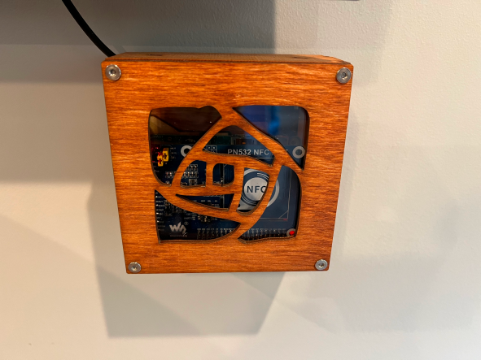

# rpi_jukebox
  
Jukebox for playing music on a Sonos speaker using NFC cards and a Raspberry Pi.

## Quickstart
1. Copy `rpi_jukebox.config-EXAMPLE` to `rpi_jukebox.config` 
2. Update with your Sonos player IP address and preferred volume
3. Get Sonos track URIs from a song playing on your Sonos player by running `python3 ./util/sonos_get_trackuri.py --config rpi_jukebox.config`
4. Enter the UID of the NFC card, song description, and Sonos track URI to the `music_map.csv` file following the format in `music_map.csv-EXAMPLE`
5. Run `python rpi_jukebox.py`
6. By default, rpi_jukebox.py will log to the console over stderr; any NFC card that is not mapped to a music track will print its UID to the console

## Parts List
### Raspberry pi
  
Old Raspberry Pi 1 B+ I had, loaded with Raspbian Bullseye 32bit lite

### Case
  
I wanted a case that was reasonably priced, looked nice, and tall enough for the NFC Hat
  https://www.c4labs.com/product/pi-squared-case-raspberry-pi-3-b-color-and-height-options/

### NFC Reader
  
Got the PN532 NFC hat from Waveshare https://www.waveshare.com/pn532-nfc-hat.htm

### Wifi dongle
Since the Pi 1B+ does not have Wifi, I used a TPLink Archer T2U Nano Wifi dongle based on the RTL8812AU chipset and compiled the driver from https://github.com/aircrack-ng/rtl8812au.git

### NFC Cards
For NFC cards, I picked up a stack of blank NTAG215 cards from Amazon

### Card Labels
Used some inkjet printable 2"x4" shipping labels so that I could print what song is on the card

## Config file options
`rpi_jukebox.py` uses configparser to read the config specified at `CONFIG_PATH` - default is `/home/pi/rpi_jukebox/rpi_jukebox.config`.  The example config file looks like this:

```
[rpi_jukebox]
jukebox_file = /home/pi/rpi_jukebox/music_map.csv
debounce_time = 10
sonos_ip = 10.10.10.10
sonos_vol = 45
log_host = 10.10.10.100
log_port = 51404
```

|Config Option|Notes|
|---|---|
|jukebox_file| The CSV file that maps an NFC card to Sonos Track URI|
|debounce_time| The time to sleep after successfully reading an NFC card and requesting Sonos to play a track |
|sonos_ip| The IP address of the Sonos controller you want to play music on|
|sonos_vol| The volume you want to always ramp the volume to|
|log_host| Optional syslog receiver host|
|log_port| Optional UDP port to use with syslog host|

## music_map CSV file format and options
Line one of the `music_map.csv` should contain the headers for the CSV:
```
rfid_uid,media_desc,sonos_uri
```
The lines following this are the individual NFC UID and the Sonos track/favorite you want to play.  For example:

```
04176b07196c80,Wham!: Last Christmas,x-sonosapi-hls-static:ALkSOiF_vVVPP7JuAy3cDs-26ZPvT_Exmu0q55JkBCkBw47N?sid=284&flags=8&sn=3
```


## util helpers
### sonos_get_favuri.py
Uses SoCo to dump out the saved items in Sonos Favorites.  I use this to get the name of a favorite from the list of favorites for `x-SONOSFAV` items in the CSV file

### sonos_get_trackuri.py
Uses SoCo to dump out the track name and URI of the track currently playing

## pn532 reader
Using the pn532 python library that Waveshare makes available and followed the instructions to configure the PN532 jumpers and switches for I2C mode.  

https://www.waveshare.com/wiki/PN532_NFC_HAT

## sonos quirks
I wanted to be able to play a radio station, Youtube Music, or Spotify Playlist, but Sonos/SoCo does not really handle this well when trying to use SoCo.add_uri_to_queue(uri), so instead I worked around it by grabbing the SoCo favorite reference from the favorites list and adding that to the queue with SoCo.add_to_queue(reference)

## Logging
